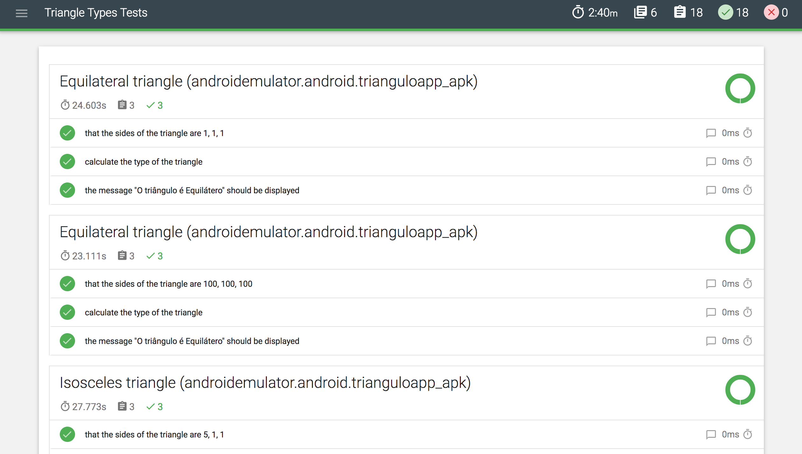

## About 

---

This task was completed using the following tools:

* [appium](http://appium.io/)
* [webdriver.io](https://github.com/webdriverio/webdriverio)
* [cucumber.js](https://github.com/cucumber/cucumber-js)
* [chai.js](https://www.chaijs.com/)

Simple testing triangle types on a mobile application running in a Android Virtual Device.

###Strategy adopted 

* **E2E** - I've choosed webdriver.io instead [wd.js](https://github.com/admc/wd) because it has a wider documentation and seems way more flexible. Since the given scenarios are not too tricky and not too long, i've prefered to do it at the UI layer.

* **Scenarios Outline** - I've used this cucumber feature to allow this suite to be elastic. So, it easier to create more tests without writing too much (e.g. boundary testing)

####Other information

- The tests for some reason are slower than i desired. I was not able to have enough time to investigate in depth (maybe because of selector strategy?)

### Prerequisites

* [JDK](https://www.oracle.com/technetwork/java/javase/downloads/jdk8-downloads-2133151.html)
* [Node.js](https://nodejs.org/en/download/)
* [Android SDK](https://developer.android.com/studio/#downloads) - You can either install Android Studio (which has the sdk embedded) or just the Android SDK.

### Installing

* ```npm install```

### Running

* ```npm test``` for execute tests

### Reporting

Using [mochawesome](http://webdriver.io/guide/reporters/mochawesome.html) to generate a html report. Easily publishable in a CI platform.



* ```npm run generate-report``` to generate a html file inside mochawesome-report folder.
* ```appium.log``` is generated at the root folder to aid  debbuging.


### Code standards

---

* [Prettier:](https://www.npmjs.com/package/prettier) Code formatter - ```npm run format```
* [Husky:](https://www.npmjs.com/package/husky) Git hooks to prevent bad commits. Currently using precommit hook
